# Week 1

## 三种概率定义

首先需要明确几个英文术语，之前上课都是用的中文，有些简单的术语可能还能反应过来指的是什么，但是另一些不常见的就不一定了。

1. Outcome：这个可能就属于不常见的。我刚开始看的时候教授一直在说 outcome，我还想难道是输出什么的吗，结果一查中文原来的对应叫“结果”，就是一个试验的结果。
2. Random Experiment：随机试验。任何有 uncertain outcome 的东西都可以叫做一个 random experiment。比如掷骰子、下一天的天气、抽扑克牌，都是 random experiment。
3. Basic Outcome：对应中文属于不太确定，基本结果？总之意思是说一个 random experiment 的所有可能 outcome，比如掷骰子对应的 basic outcome 就是 `[1, 2 , 3, 4, 5, 6]`。
4. Sample Space (S)：样本空间。所有 basic outcome 就构成了该 random experiment 的 sample space。一般用 $S$ 表示。
5. Event ($A, B, ...$)：事件。sample space 的子集就是一个 event。一般我们可能会说某事件发生的概率，就指的是这个。一般用大写字母如 $A$ 表示。

下图是一个完整例子：

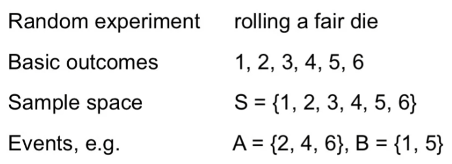  

OK，现在可以来说三种概率定义了。其实看之前我都不确定存在三种概率定义，也可能是上学的时候讲过，但现在太久忘了。

### 第一种定义：Classical Probability

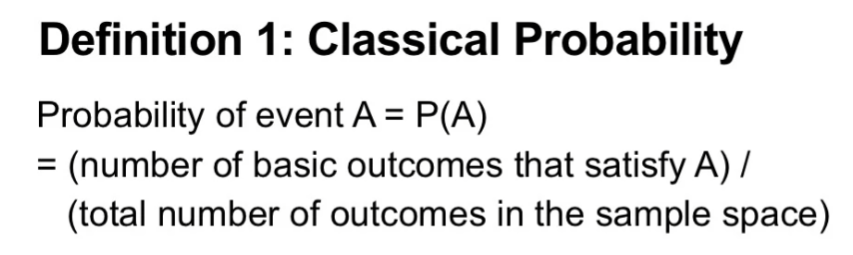  

最简单的一种，经典概率。对于 event A，其概率就是所有满足 A 的 basic outcome 的数量，除以 sample space 的大小。

这种概率有一个假设：所有 basic outcome 出现的概率都是相等的。所以假设共有 N 个 basic outcome，那么每个 outcome 出现的概率就是 1/N。掷骰子就是个很好的例子，每一次骰子出现的数字就适用于这种概率定义。

### 第二种定义：Empirical Probability

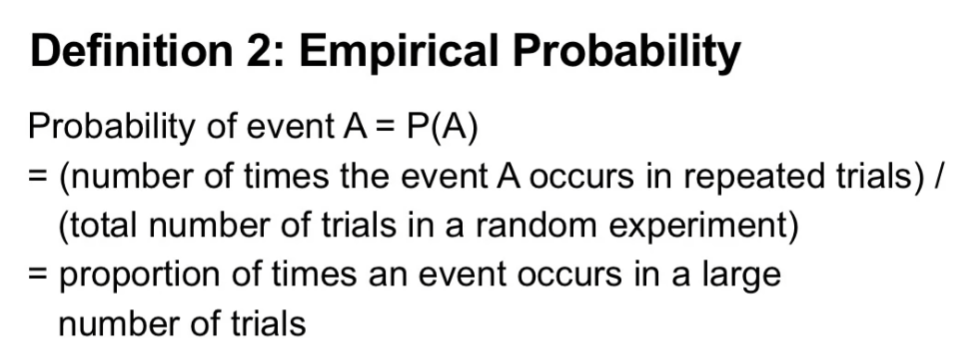  

经验概率。这个 Empirical 经验是关键词。用经验来预估未来事件发生的概率，是不是有机器学习那味了？实际上机器学习就是基于此的，核心思想一样。

先说一个概念，每个 random experiment 可能会进行多次尝试（或者叫试验），这每次尝试就叫做一次 trial。

那么对于 event A，我们会做很多次 trial，里面会有 A 发生的 trial 也会有没发生的，那么发生的数量除以总 trial 数就是 A 发生的概率。

比如说我们存储有过去每天的天气情况，我们就可以用这些过去的天气来预测明天的天气情况。过去某天的天气情况就是一次 trial。

### 第三种定义：Subjective Probability

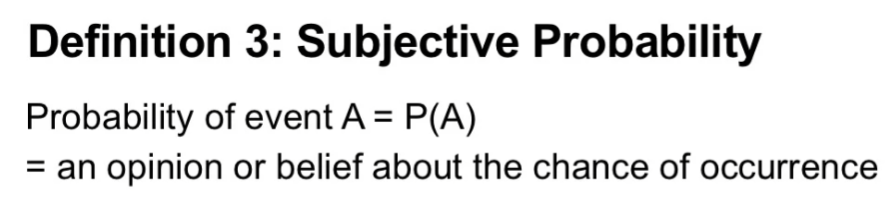  

主观概率。顾名思义，这玩意真是非常的主观，A 发生的概率全在于你的主观意愿，你的 opinion 你的 belief。

---

OK，三种概率定义讲完了，但无论哪种概率定义，本质上它都是概率，是概率就要符合一个叫做 Kolmogorov axioms 的公理，或者叫概率公理，前面那个词是提出者的名字，全名叫 Andrey Nikolaevich Kolmogorov，他于 1933 年提出的这个公理。

具体来说包含三条公理：

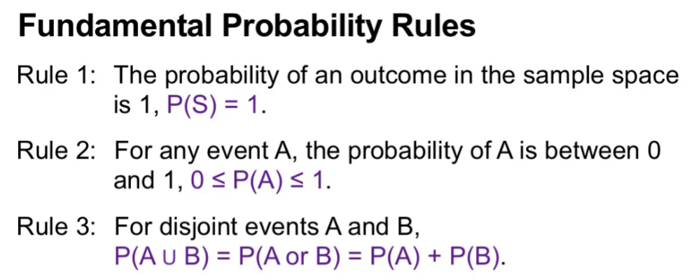  

Rule 1 是说整个 sample space 的发生概率必然是 1，也就是说一次 random experiment 必然要有 outcome 发生，而且这个 outcome 也必然在 sample space 中。

Rule 2 是说概率值的范围，值域，必须在 0 到 1 的闭区间内。

Rule 3 是说 disjoint events A 和 B 的概率等于他们各自概率之和。什么叫 disjoint events？A 和 B 分别是一个集合，如果 A 和 B 之间没有共同元素也就是交集为空，那么这两个 event 就叫做 disjoint events。但是如果 A 和 B 的交集不为空呢，那 rule 3 就要稍微改动下了，减去两者共有也就是重复计算的那部分：

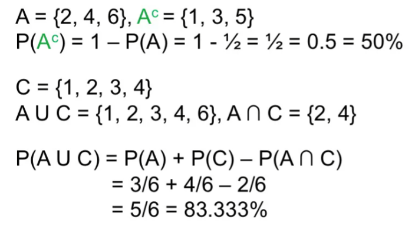  

所以说，即使是主观概率，概率多少完全取决于你主观意愿，那你也不能违反这三条公理，比如你不能说今天下雨的概率是 110%。

另外我们也可以换一个角度来理解这三种概率定义：

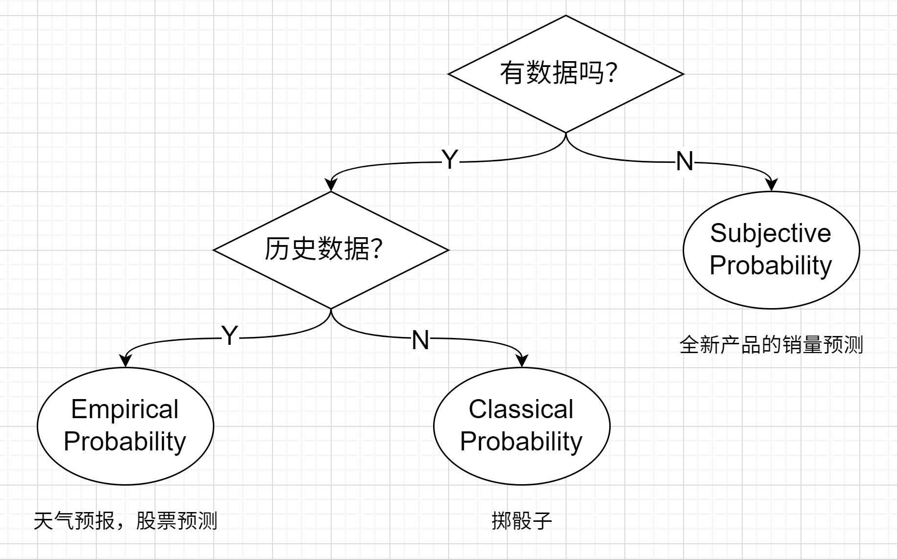  

按照数据匮乏的程度排序，依次是：一点数据都没有的 Subjective Probability、有数据但是没有或不能根据历史数据预测只能进行简单计算的 Classical Probability 和有历史数据的 Empirical Probability。

## 统计独立 (Statistical Independence)

这个比较好理解了，对于 event A 和 event B，A 的发生与否对 B 的发生与否没有任何影响，反之亦然，那么我们就说 A 和 B 是独立的，即互相不受影响。

对于独立事件概率的计算也相对简单，由于互相独立，所以我们可以直接让两个事件单独发生的概率直接相乘即可，比如掷两次骰子，数字组合为 `(1, 6)` 这一事件发生的概率，那么就是第一次掷出来 `1` 这个事件（A）发生的概率乘以第二次掷出来 `6` 这个事件（B）发生的概率，第一次掷出来 `1`，并不会影响第二次掷出来的数字是多少。

正式来讲：

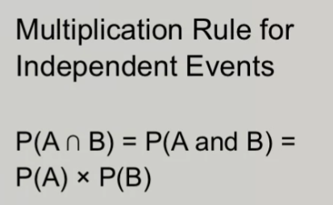 

## 主观概率与合取谬误

之前说过，主观概率也是概率，也是需要符合概率公理和基本性质的。其中一个基本性质就是A和B交集的发生概率绝对要小于A和B分别的概率。从集合角度很好理解，交集大小是不可能大于独立集合的：

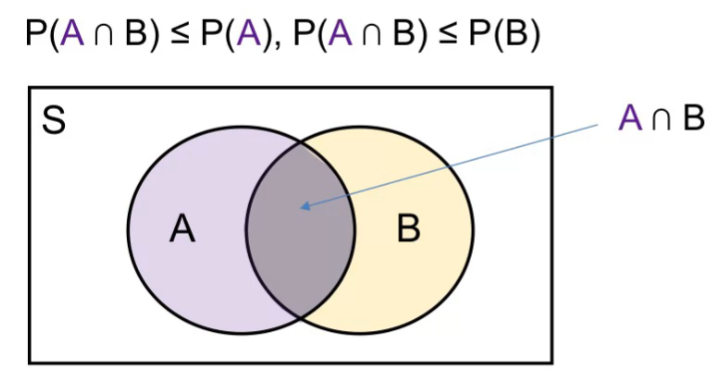  

但是人们经常会犯这个错误。下面是一个例子：

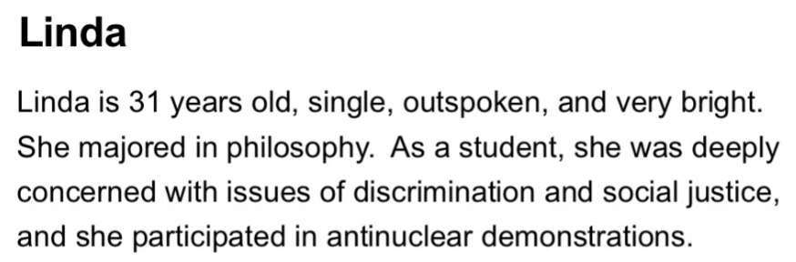  

大意是说，Linda 31岁，学生，单身女性，为人爽快，非常关注歧视问题和社会正义，参与过反核示威游行。这是背景，基于此背景，下面有一些说法，按照你认为的可能性排序，1表示最可能，8表示最不可能：

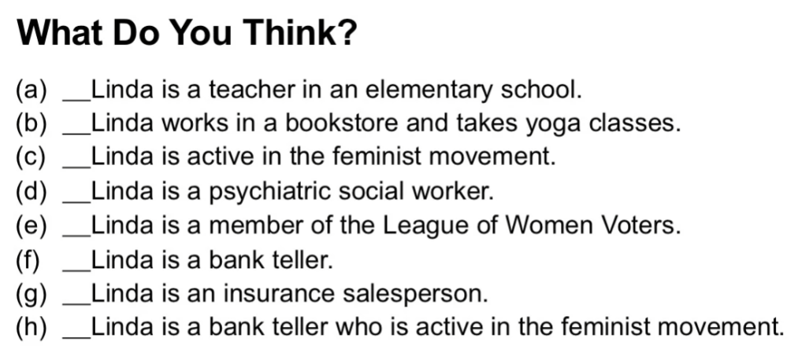  

这里面存在交集和独立集合，c、f 和 h，c表示她积极参与女权运动，f表示她是个银行柜员，h表示她是个积极参与女权运动的银行柜员。

很多人都会认为h要比f更有可能，事实上教授在他的学生中做过多次实验，结果表明 80% 的学生都这么认为。但仔细想一下，这很明显是错误的。如果h概率大，那么f的概率应该更大，因为h要想成立，那么c是一个前提也必须成立，是一个积极参与女权运动的银行柜员的前提是她是个银行柜员。

这种类型的错误叫 Conjunction Fallacy，合取谬误。

我自己也在身边人做了下实验，结果同样。

## 经验概率与 Benford's Law

有一个问题叫“Leading Digits”，对于一个数字，其第 0 位的数字就是 leading digit，值域为 1-9 闭区间。Leading digits 问题就是说在大量数字中这些 leading digit 的分布是怎么样的，均匀分布，每个数字出现的可能性都是一样的？还是有所偏重？这明显是一个经验概率的问题，我们可以使用现有数据来估计。

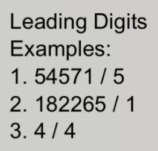  

答案就是 Benford's Law：

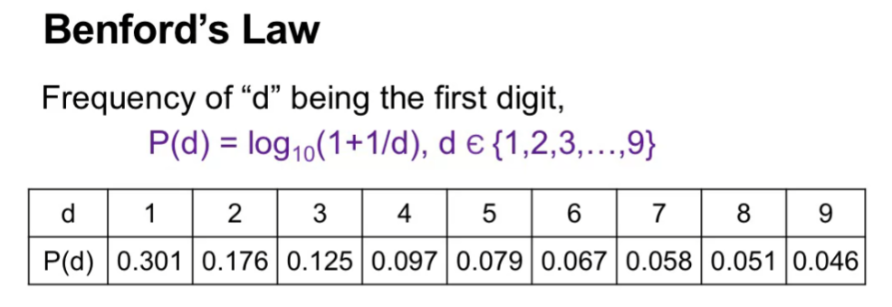  

从 1-9 出现的概率按照 $\log_{10}(1+\dfrac{1}{d})$ 的规律递递减，如果用条形图画出来，就是下面这个样子：

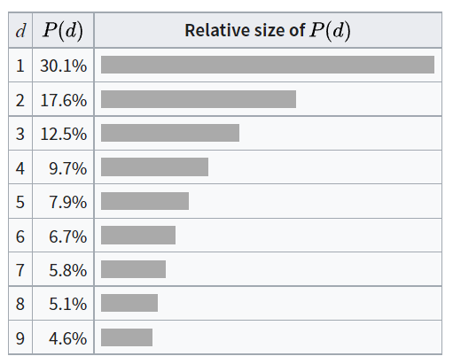  

课上教授举了几个例子来说明。第一个是美国各县人口统计数据：

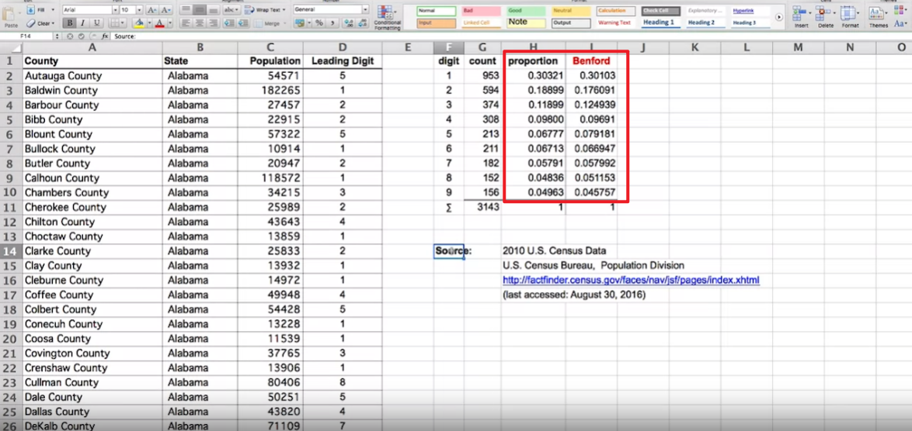  

可以看到和 Benford's law 还是非常接近的。

第二个是美国职业人口统计数据，即每个职业的人数：

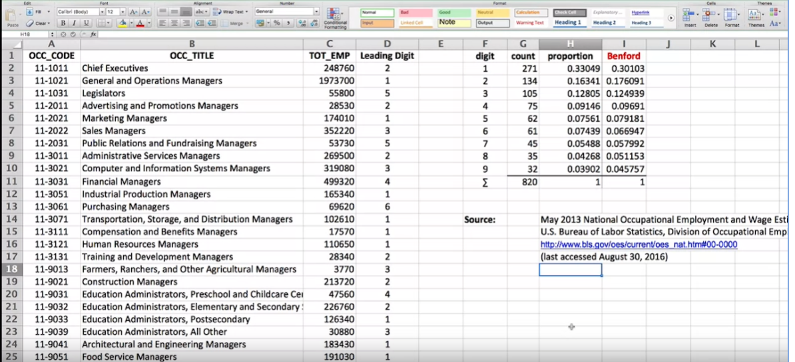  

仍然是非常接近。

所以说，只要不是人为操控或造假的数据，正常数据都应该是符合 Benford's law 的。再次注意前提是自然产生而非人为操控的数据，像手机号这种是人为划定范围的，属于人为操控的，就不符合 Benford's law，毕竟这开头全是 1……

那么，反过来想一下，如果自然产生的数据不符合 Benford's law 呢？我们可以认为这实际上有可能发生了人为篡改吗？还真的是有人这么做的。教授举了两个例子，一个是瑞士将 Benford's law 用于检测金融和税收欺诈，具体我也不是很了解这里面的税收机制，说什么和欧盟、美国的税收机构存在信息交换啥的没太懂，一些人会通过开通多个账号来避税。不过重要的是验证他们的税收是否符合 Benford's law，如果不符合，那么就怀疑他们存在避税。具体可以参考这篇论文[^1]。不过在中国似乎不行吧，每个月交的税都是公式计算好而且差不了多少都在一个范围内的。

另一个例子是关于希腊加入欧盟的事，有人研究了希腊加入欧盟前 5 年和更早些年的预算，发现前者不合符 Benford's law，而后者是符合的，所以该研究者推断希腊为了加入欧盟，篡改了预算数据。当然似乎听起来有点离谱，但是 Benford's law 本身就听起来感觉挺离谱的，然而却是经过事实验证是正确的。

[^1]: Nigrini, Mark J. "A taxpayer compliance application of Benford's law." The Journal of the American Taxation Association 18.1 (1996): 72.