# Week 2

Week 2 主要讲条件概率 Conditional Probability。

## 直观解释及定义

当时上学的时候没怎么入门，老师讲条件概率的时候比较懵，没有花太多时间去琢磨去深刻理解，只顾着背公式做题应付考试了。Karl 教授先是用瑞士各地区的主要语言这个例子来引入条件概率。比如以下两个概率：

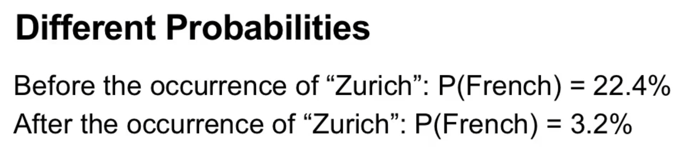  

1. 你在瑞士遇到一个人，他主要讲法语的概率。
2. 已知这个人住在苏黎世，那么他主要讲法语的概率。

这两个概率很明显是不同的，因为苏黎世是德语区，主要说德语，如果知道他住在苏黎世，那么他很可能不说法语。

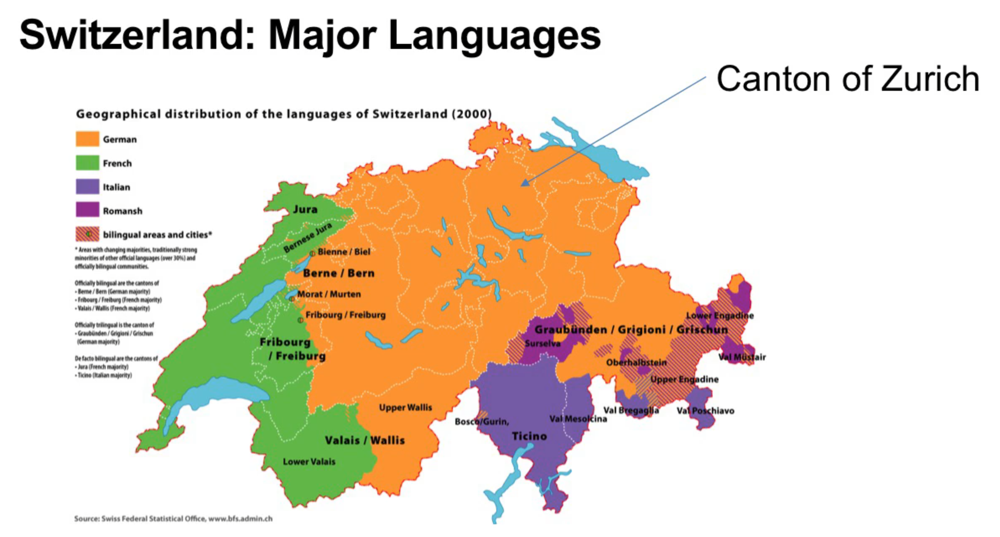  

换句话说，“已知这个人住在苏黎世”这个信息改变了“在瑞士遇到一个人，他主要讲法语”这一事件的概率，这就是条件概率，有条件的概率。另一方面也说明了这两个事件不是独立的。

维恩图可以非常直观地解释条件概率，解释上述概率的变化：

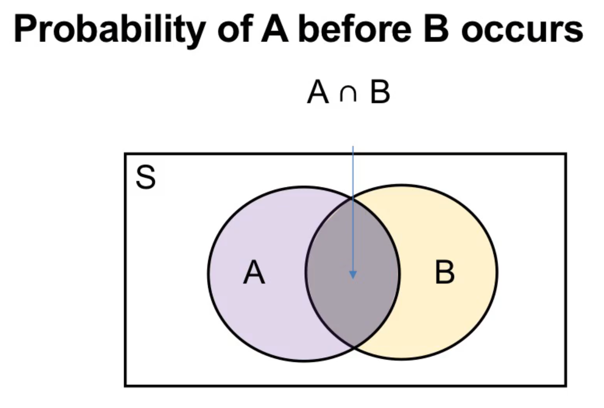  

B 发生之前 A 发生的概率，也就是 $P(A) = \dfrac{P(A)}{P(S)}$，此时 sample space 是 S。

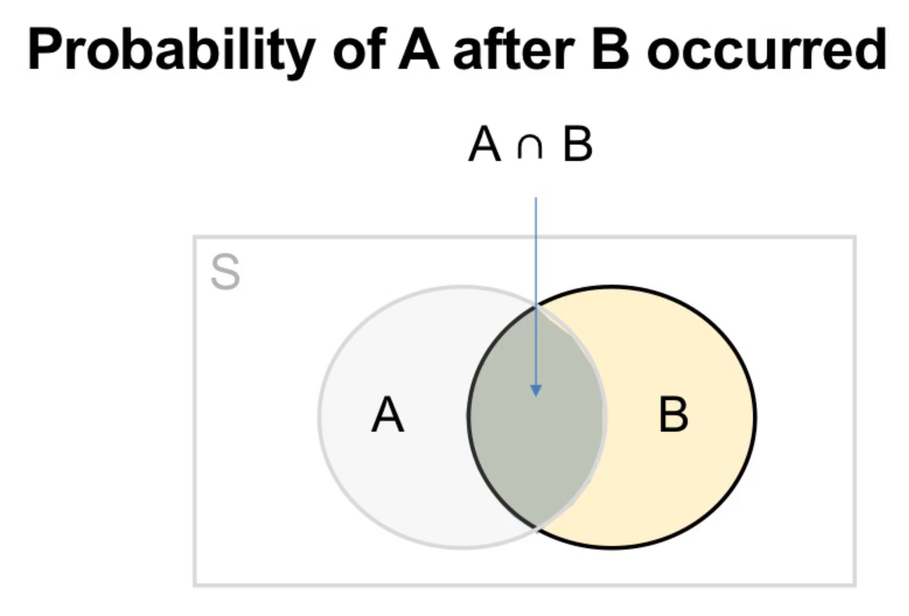  

B 发生之后 A 发生的概率，此时 sample space shrink down 到了 B，B 之外的已经没有意义不可能发生了。此时的 $P(A)$（严格来说是 $P(A|B)$）变成了 $\dfrac{P(A \cap B)}{P(B)}$。

此时条件概率的公式：

$$ P(A|B) = \dfrac{P(A \cap B)}{P(B)} $$

也就水到渠成了。

## 独立性 Independence

仍然使用维恩图来解释，以掷骰子为例。

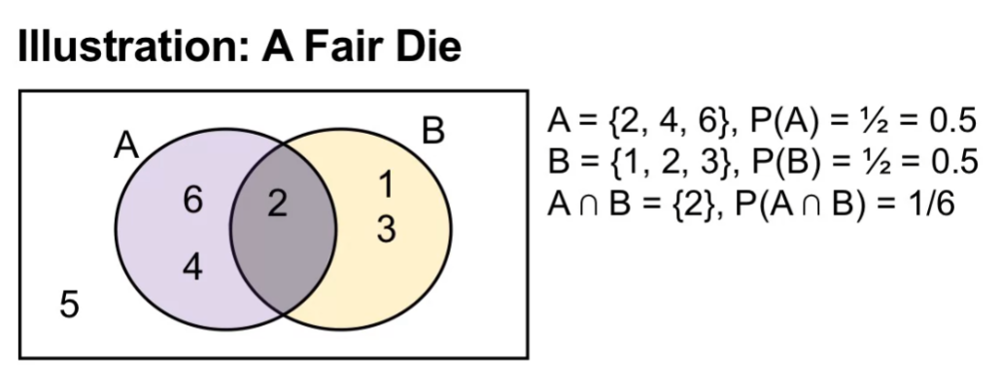  

我们可以很容易算出来 B 发生前后 A 发生的概率：

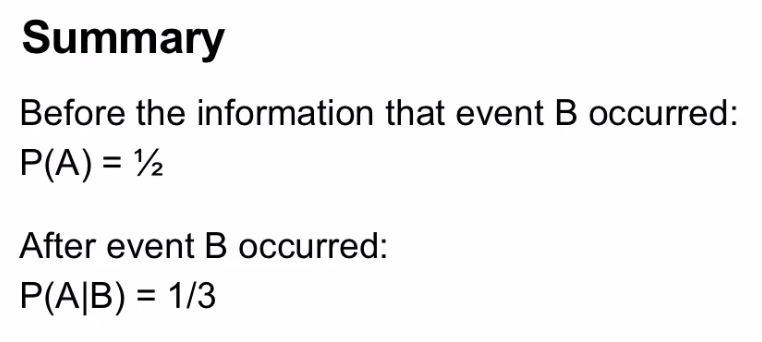  

可以看出 B 发生之后，A 发生的概率降低了，B 的信息影响了 A 的概率，所以 A 和 B 是 dependent 不独立的。

我们稍微改下这个例子：

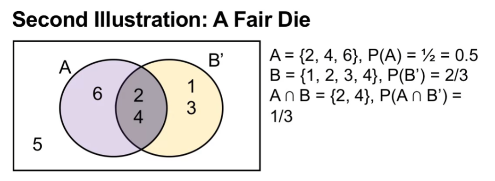  

然后再算下 B' 发生前后 A 发生的概率：

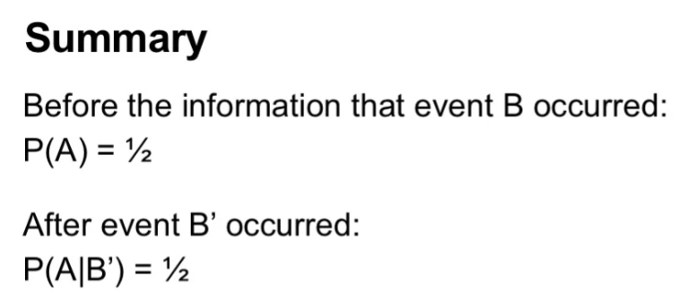  

A 的概率保持不变，不受 B' 的影响，所以此时 A 与 B' 是 independent 独立的。

## Multiplication Rule

由上面可知：

$$ P(A|B) = \dfrac{P(A \cap B)}{P(B)} $$
$$ P(B|A) = \dfrac{P(A \cap B)}{P(A)} $$

所以：

$$ P(A \cap B) = P(A|B) \times P(B) $$
$$ P(A \cap B) = P(B|A) \times P(A) $$

这就是 multiplication rule 了，用于计算 A 和 B **同时**发生的概率。注意区别 $P(A \cap B)$ 和 $P(A|B)$，前者是同时发生，后者是 B 先发生。

举个例子，已知瑞士有 17.6% 的人居住在苏黎世，而苏黎世有 19.6% 的人是 0-19 岁。那么问：一个瑞士人居住在苏黎世且年龄是 0-19 岁的概率有多大？

下意识我们会觉得是 17.6% × 19.6%。其实这已经是运用了 multiplication rule 了：

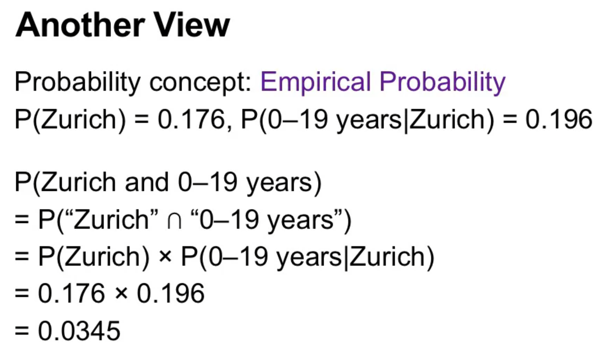  

对于独立事件，multiplication rule 变得更加简单：

$$ P(A \cap B) = P(A|B) \times P(B) = P(A) \times P(B)$$

毕竟 A 发生的概率不受 B 影响。

但实际生活中使用时要注意辨别 A 和 B 是否真的独立。

## Probability Table

这个是我觉得最受益最方便的知识之一了。

如果我们有多个事件如何方便地进行计算呢？我们需要一种标准化的工具，这就是概率表 probability table，长这样：

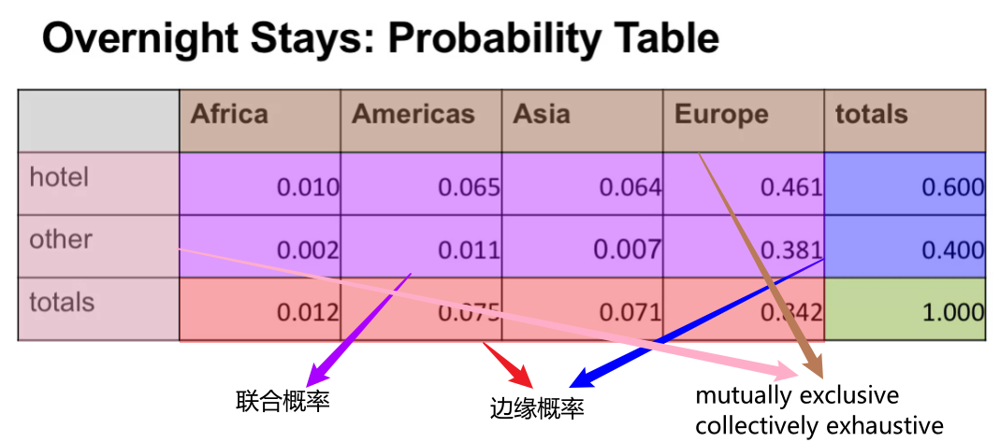  

中间紫色表示的是联合概率 joint probability，也就是 $P(A \cap B)$，表格边缘的红色和蓝色表示的是边缘概率 marginal probability，即 $P(A)$ 等，右下角的绿色格子表示 sample space 的概率，一定为 1。上方的棕色和左侧的粉色表示事件，他们分别是 mutually exclusive 和 collectively exhaustive 的，也就是说他们分别互相独立且完整构成一个 sample space，独立性和完备性。

一旦我们有了这个表格，想要算什么条件概率都变得异常简单。比如 given 一个人是亚洲人，那么 TA 住酒店的概率有多高？0.064 / 0.071 = 90.14%，还是相当高的。

## Bayes Rule

Given A 已发生时 B 发生的概率和 given B 已发生时 A 发生的概率是不同的，这两者是有关系的，贝叶斯定理就是用来描述这种关系的。暂且不看 ugly 的 贝叶斯公式，还是先看一个例子。

有一家公司有三个供应商，S、T 和 U，每家生产出 good 和 bad parts 的概率分别都是 90% 和 10%。在 good parts 中，60% 由 S 提供，25% 由 T 提供，15% 由 U 提供。在 bad parts 中，40% 由 S 提供，30% 由 T 提供，30% 由 U 提供。

问：哪家供应商提供 good parts 的概率比较高？

可能比较绕。我们来仔细分析下。我们的已知信息是：

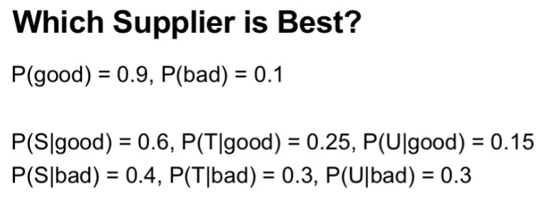  

而问题是要求 given 供应商下 good/bad 的概率，比如 $P(good|S)$。所以我们现在知道 $P(S|good)$，flip 一下，要求 $P(good|S)$。

还记得刚才说的神器 probability table 吧？我们来尝试画一下：

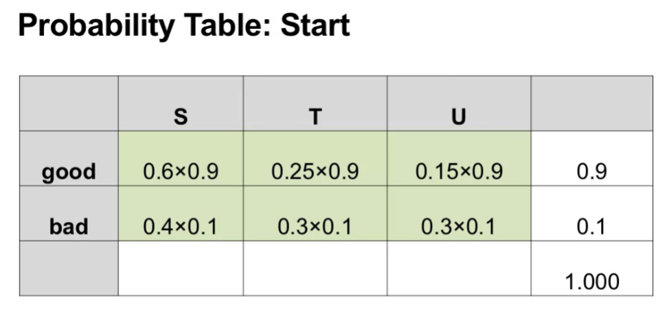  

每一个绿格子都是用了刚才说的 multiplication rule。然后把剩余格子填上：

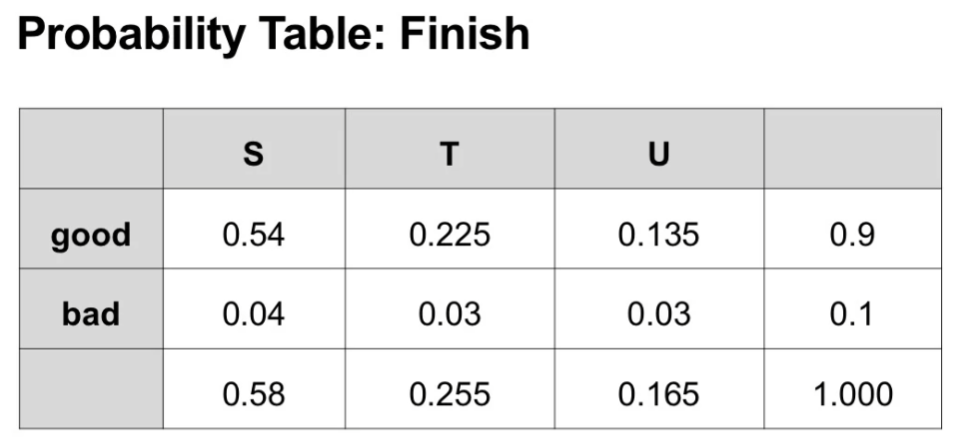  

OK，现在我们有了这个，可以说是无敌了，想算什么都可以。比如刚才我们要算的是 $P(good|S)$，那么 0.54 / 0.58 = 0.931。同理，$P(good|T) = 0.225 / 0.255 = 0.882$，$$ P(good|U) = 0.135 / 0.165 = 0.818$。所以 S 提供 good parts 的概率最高，是 best supplier。

我们来看下 $P(good|S)$ 的计算过程：

$$ \begin{align}
P(good|S) &= \dfrac{0.54}{0.58} \\
&= \dfrac{0.6 \times 0.9}{0.6 \times 0.9 + 0.4 \times 0.1} \\
&= \dfrac{P(S|good) \times P(good)}{P(S|good) \times P(good) + P(S|bad) \times P(bad)} \\
&= \dfrac{P(S \cap good)}{P(S \cap good) + P(S \cap bad)} \\
&= \dfrac{P(S \cap good)}{P(S)}
\end{align}
$$

我们无形中就得到了贝叶斯公式，找到了 $P(good|S)$ 和 $P(S|good)$ 之间的联系，已知三个概率来求另一个概率：

$$P(A|B) = \dfrac{P(B|A) \times P(A)}{P(B|A) \times P(A) + P(B|A^C) \times P(A^C)}$$

推广一下，假如 A 的完备事件组有多个元素，那么：

$$P(A_i|B) = \dfrac{P(B|A_i) \times P(A_i)}{\sum_j P(B|A_j) \times P(A_j)}$$

单看公式还是挺恐怖的，不过结合供应商的例子和神器 probability table 这个神器，就自然而然很好理解了。
